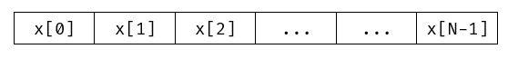
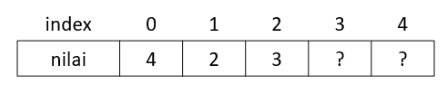
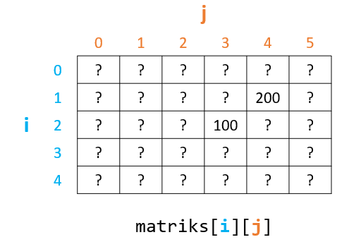

# Array dan String

# Array

## Pengenalan Array

Array merupakan jenis struktur data yang menampung elemen betipe data sama secara sekuensial dengan ukuran (kapasitas) yang tetap (fixed-size). Bayangkanlah sebuah array sebagai sekumpulan elemen sejenis yang disusun secara berurutan pada satu identifier (nama).

<!-- ## Array Satu Dimensi -->

## Deklarasi Array

Array juga sama seperti variabel, perlu dideklarasikan terlebih dahulu sebelum bisa digunakan. Deklarasi array sama seperti variabel, hanya saja saat pendeklarasiannya perlu dituliskan ukurannya.

```
tipe_data identifier_array[size];
```

## Inisialisasi Array

Kita juga bisa menginisialisasi elemen-elemen pada array setelah dideklarasikan. Sintaksnya adalah seperti berikut.

```
tipe_data identifier_array[size] = {elem1, elem2, elem3, ....}
```

## Mengakses Array

Seperti yang telah dijelaskan sebelumnya, array disimpan secara sekuensial (pada blok memori secara berurutan). Lalu bagaimana kita mengakses tiap elemennya? Pengaksesan elemen pada array dilakukan dengan menuliskan identifier arraynya lalu digabung dengan menggunakan operator subscript `[]` dengan menyertakan indeks didalamnya.



Indeks pada array menggunakan zero-based index, yang artinya elemen pertama pada array ditunjukkan oleh indeks ke 0 (bukan ke 1) dan elemen terakhir ditunjukkan oleh indeks ke N-1 (misal N adalah panjang array).
Elemen-elemen pada array dapat diperlakukan sama seperti halnya variabel. Kita dapat melakukan assignment, operasi aritmatika, dan lain-lain.


Contoh :

```c
int main () 
{

  int a[10]; //Deklarasi Array
  
  int b[5] = {1, 2, 3, 4, 5}; //Inisialisasi Array
  
  a[0] = 50;
  a[1] = 20;
  
  printf("%d %d\n", a[0], a[1]);
  
	return 0;

}
```

Mengapa kita perlu array? Andaikan kita membutuhkan 1000 inputan data, kita tidak perlu membuat deklarasi variabel berjumlah 1000, misalkan variabel a1 hinga a1000. Namun, kita cukup menuliskan 1 identifier array berkapasitas 1000.

Contoh program tanpa array:
```c
int main () {

  int a, b, c, d, e; //Deklarasi 5 variabel integer
  
  scanf("%d %d %d %d %d", &a, &b, &c, &d, &e);
  
  printf("Bilangan pertama adalah %d\n, a);
  printf("Bilangan kedua adalah %d\n, b);
  printf("Bilangan ketiga adalah %d\n, c);
  printf("Bilangan keempat adalah %d\n, d);
  printf("Bilangan kelima adalah %d\n, e);
  return 0;

}
```

Bayangkan kita tidak hanya memasukkan 5 data, melainkan 1000 data, bagaimana kita mendeklarasikan semuanya dalam variable dan kemudian mencetaknya? Maka dari itulah array digunakan.

Contoh program menggunakan array:
```c
int main () 
{
	int a[5], i; 
	for(i = 0; i < 5; i++) {
		scanf("%d", &a[i]); //Input array
	}

	for(i = 0; i < 5; i++) {
		prinf("Bilangan ke-%d adalah %d\n", i+1, a[i]; // Output array
	}

	return 0;

}
```
## Dimensi Array

### Array Satu Dimensi

Sebuah array dikatan berdimensi satu apabila tiap elemennya hanya menyimpan satu data/objek. Contoh-contoh pada penjelasan sebelumnya merupakan array satu dimensi.

Contoh array satu dimensi :

```c
int main()
{
	int arr[5];
	arr[0] = 4;
	arr[1] = 2;
	arr[2] = 3;
	return 0;
}
```

Jika diilustrasikan, maka array tersebut akan tampak seperti di bawah.



### Array Multidimensi

Sebuah array dikatakan multidimensi apabila tiap elemen array  menampung array lainnya. Apabila array satu dimensi hanya memiliki sebuah index, array multidimensi memiliki dua atau lebih index untuk mengakses elemen dalam array tersebut. 

Cara deklarasinya pun berbeda dari array satu dimensi. Kita memerlukan N buah kurung siku untuk membuat array dengan N-dimensi.

Berikut adalah contoh program dengan array dua dimensi:
```c
int main () 
{
	int matriks[5][6];
	matriks[2][3] = 100;
	matriks[1][4] = 200;
	return 0;
}
```

Apabila diilustrasikan, bentuk array dua dimensi layaknya baris dan kolom, seperti gambar di bawah.



Selain bentuk dua dimensi, kita dapat membuat array hingga N-dimensi, sesuai kebutuhan.

# String

## Pengenalan String

Secara umum, string merupakan kumpulan dari satu atau lebih karakter. Spesifik pada bahasa C, string didefinisikan sebagai kumpulan karakter yang diakhiri oleh karakter null (`'\0'`).

Misalkan string `"Dasar"`, pada bahasa C direpresentasikan sebagai kumpulan karakter `'D'`, `'a'`, `'s'`, `'a'`, `'r'`, dan `'\0'`.

## Representasi String

Pada bahasa C, string direpresentasikan oleh array bertipe `char`.
Contoh pendeklarasian string:
```c
#include <stdio.h>

int main () 
{  
	char str[] = "Halo"; 
	return 0;

}
```

Contoh di atas akan mendeklarasikan string bernama str dengan kapasitas 5 karakter, di mana `str[0] = 'H'`, `str[1] = 'a'`, `str[2] = 'l'`, `str[3] = 'o'`, dan `str[4] = '\0'`.
Perhatikan bahwa str[4] berisi karakter '\0' (null character), walaupun dalam literal string di atas tidak ada karakter tersebut. 

Dalam bahasa C, karakter null digunakan untuk menandakan akhir dari sebuah string.

Contoh pendeklarasian string (2):
```c
#include <stdio.h>

int main () {
  
  char array[10];
  
  return 0;

}
```

Contoh di atas akan mendeklarasikan string bernama array yang dapat menampung maksimal 10 karakter, termasuk null character.

Untuk menerima input string dari user, kita dapat menggunakan scanf atau gets. Perintah scanf akan membaca inputan string dari user dan berhenti ketika ada whitespace ataupun interupsi dari pengguna. Sedangkan gets akan membaca satu baris kumpulan karakter hingga enter atau interupsi dari pengguna.

Contoh source code penggunaan scanf untuk membaca string:
```c
#include <stdio.h>

int main () {
  
	char array[10];
	while(true)
	{
		scanf("%s", arr);
		printf("-- %s\n", arr);
	}
	return 0;

}
```

Contoh penggunaan gets untuk membaca string:
```c
#include <stdio.h>

int main () {
  
	char arr[100];
	while(true)
	{
		gets(arr);
		
		printf("-- %s\n", arr);
	}
  return 0;

}
```
String yang dibaca dengan mengunakan scanf atau gets akan secara otomatis memiliki null character di akhir.

## Fungsi-Fungsi String

Dalam bahasa pemrograman C, terdapat library yang dibuat dengan tujuan memudahkan pengguna dalam mengolah string. Library tersebut tersimpan dalam `<string.h>`, oleh karena itu, untuk mengakses library ini, diperlukan tambahan, yaitu:

```c
#include <string.h>
```

Berikut adalah fungsi-fungsi yang dibagi berdasarkan kegunaannya dalam mengolah sebuah string (diambil dari www.cplusplus.com):
- Copying :
  + memcpy (Copy block of memory)
  + memmove (Move block of memory)
  + strcpy (Copy string)
  + strncpy (Copy characters from string)
- Concatenation :
  + strcat (Concatenate strings)
  + strncat (Append character from string)
- Comparison :
  + memcmp (Compare two blocks of memory)
  + strcmp (Compare two strings)
  + strcoll (Compare two strings using locale)
  + strncmp (Compare characters of two strings)
  + strxfrm (Transform string using locale)
- Searching :
  + memchr (Locate character in block of memory)
  + strchr (Locate first occurrence of character in string)
  + strcspn (Get span until character in string)
  + strpbrk (Locate characters in string)
  + strrchr (Locate last occurrence of character in string)
  + strspn (Get span of character set in string)
  + strstr (Locate substring)
  + strtok (Split string into tokens)
- Other :
  + memset (Fill block of memory)
  + strerror (Get pointer to error message string)
  + strlen (Get string length)

Berikut adalah beberapa fungsi dan penjelasannya.

### Fungsi strcpy 
```c
char * strcpy ( char * destination, const char * source );
```
Fungsi strcpy digunakan untuk melakukan copy dari sebuah string ke string lainnya. 
Contoh penggunaan dalam kode program:
```c
#include <stdio.h>
#include <string.h>

int main () {
  
	char a[] = "Halo";
	char b[10];
	
	// Copy string a ke string b
	strcpy(b, a);
	
	printf("%s\n", b);
	
	return 0;

}
```

### Fungsi strcat 
```c
char * strcat ( char * destination, const char * source );
```
Fungsi strcat digunakan untuk melakukan penempelan sebuah string pada akhir suatu string tertentu. 
Contoh penggunaan dalam kode program:

```c
#include <stdio.h>
#include <string.h>

int main () {
  
	char a[] = "Halo";
	char b[] = " Kawan";
	char c[20];
	
	// Copy string a ke string b
	strcpy(c, a);
	
	// Tempelkan string b ke akhir string c
	strcat(c, b);
	
	printf("%s\n", c);
	
	return 0;

}
```

### Fungsi strcmp
```c
int strcmp ( const char * str1, const char * str2 );
```
Fungsi strcmp digunakan untuk melakukan pembandingan sebuah string dengan string yang lain. Return value dari fungsi ini dapat berupa bilangan negatif, nol ataupun positif. Jika fungsi ini mengembalikan nilai negatif, maka str1 memiliki tingkat leksikoglafi lebih kecil dari str2. Sedangkan jika fungsi ini mengembalikan nilai postifi, maka str1 memiliki tingkat leksikografi lebih besar dari str2. Terakhir, jika return value nya nol, maka str1 sama dengan str2. 

Berikut adalah contoh penggunaan fungsi ini dalam kode progam:
```c
#include <stdio.h>
#include <string.h>

int main () {
  
    char a[] = "Halo";
	char b[] = "Hai";
	char c[] = "Halo;
	
	if(strcmp(a, b) == 0) printf("String a sama dengan b\n");
	else printf("String a tidak sama dengan b\n");
	
	if(strcmp(a, c) == 0) printf("String a sama dengan c\n");
	else printf("String a tidak sama dengan c\n");
	
	return 0;

}
```

### Fungsi strlen
```c
size_t strlen ( const char * str );
```
Fungsi strlen digunakan untuk mengetahui panjang dari sebuah string.
```c
#include <stdio.h>
#include <string.h>

int main () {
  
	char a[] = "Halo";
	
	printf("Panjang string a adalah %d\n", strlen(a));
	
	return 0;

}
```

# Soal Latihan

### Soal 1

Buatlah program untuk mencetak N buah angka yang diinput secara terbalik. Input baris pertama adalah N yang merupakan banyaknya angka yang akan diinput. Baris berikutnya terdapat N buah angka (dipisahkan spasi).

**Contoh Input**

```
5
1 4 3 2 9
```

**Contoh Output**

```
9
2
3
4
1
```
### Soal 2

Buatlah sebuah program untuk menghitung jumlah huruf vokal yang terdapat pada sebuah string S. Panjang string S tidak melebihi 100 karakter dan terdiri dari huruf lowercase, uppercase dan spasi.

**Contoh Input**

```
Dasar Pemograman Keren
```

**Contoh Output**

```
A/a : 4
I/i : 0
U/u : 0
E/e : 3
O/o : 1
```

### Soal 3

Diberikan sebuah nama variabel dalam bentuk **snake_case**. Buatlah program untuk mengubah nama variabel tersebut menjadi bentuk **camelCase**. Nama variabel hanya terdiri dari huruf lowercase, uppercase, dan simbol underscore.

**Contoh Input 1**

```
skor_pemain
```

**Contoh Output 1**

```
skorPemain
```

**Contoh Input 2**

```
VariabEl_Satu
```

**Contoh Output 2**

```
variabelSatu
```
